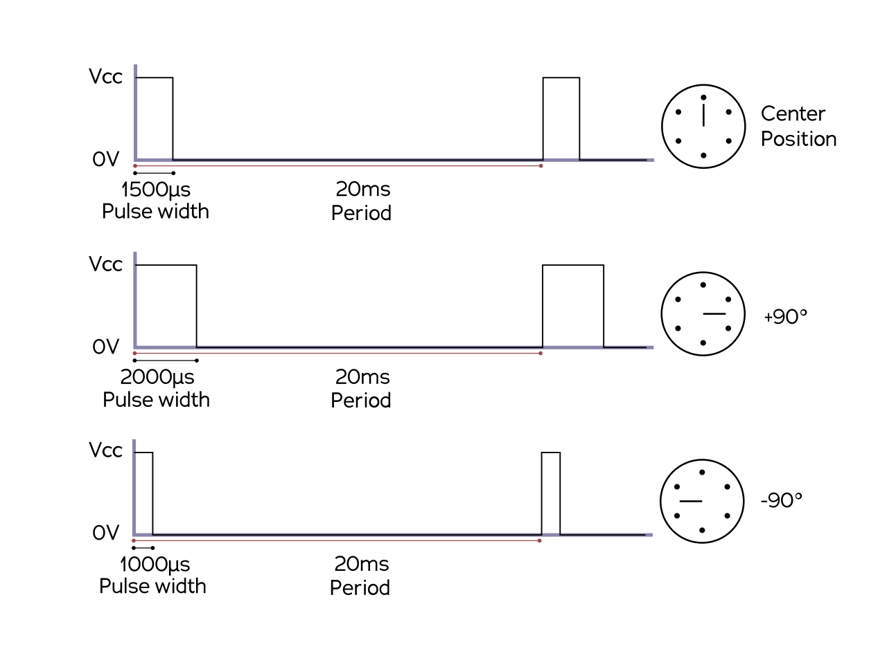

# Software how-to
Guide and general tips on using MASLAB software and other software to interact with sensors and actuators on the robot. Checkout [kitbot how-to](https://github.com/MASLAB/kitbot-how-to) to learn how to connect the hardwares.

## Prerequisites
Raven board [fully soldered](https://github.com/MASLAB/kitbot-how-to?tab=readme-ov-file#servo-connection) with [firmware deployed](https://github.com/MASLAB/kitbot-how-to?tab=readme-ov-file#raven-setup) and the Pi.

# MASLAB software library
MASLAB staffs maintain a Python library that supports using the motors and servos on the Raven board (`raven`) along with an integrated IMU (`icm42688`). The library is installed on the Pi as part of the kitbot [Raven setup](https://github.com/MASLAB/kitbot-how-to?tab=readme-ov-file#raven-setup).

> [!IMPORTANT]
> Since these library is communicating with a hardware, no two instances may run at the same time. **DO NOT** have two different ROS2 nodes trying to use Raven. Instead, have a node subscribing to some Raven control messages and have other nodes publish messages for controlling.

The library is available at https://github.com/MASLAB/maslab-lib.

## Import Raven
```Python
from raven import Raven

raven_board = Raven()
```

# DC Motors
DC motors may come with encoders to estimate how many rotation has the motor rotated. To increase the resolution of the encoder, the encoder spins with some gear ratio with respect to the motor, which also has another gear ratio. For example, the provided motor is a 10:1 motor with an encoder that does 11 counts per revolution (also called pulse per revolution). This means the encoder will count 10 * 11 = 110 counts per motor rotation.

Raven supports up to [5 DC motors with encoders](https://github.com/MASLAB/kitbot-how-to?tab=readme-ov-file#motor-connection). 

## Encoder
With Raven, you can get the encoder values. You can also set them to a new initial value, useful for initialization because Raven remembers the old encoder values while the robot is running. Here is an example of how to use it:

```Python
raven_board.set_encoder_value(Raven.MotorChannel.CH1, 0) # Set encoder count for motor 1 to zero
print(raven_board.get_encoder_value(Raven.MotorChannel.CH1)) # Print encoder count = "0"
```

## Motor
There are 3 ways to drive the motors:
* Direct - Motor moves according to a torque and speed factor. We recommend driving in direct mode first to get things started.
* Position (requires encoder) - Motor moves to an encoder position with PID control
* Velocity (requires encoder) - Motor moves with a set encoder velocity using PID control
* Disabled - Turn off the motor

To use the motors, make sure you have [imported Raven](#import-raven). Then follow the following examples for each mode.

> [!TIP]
> Once motor mode and PID values are set, you can set motor drive values without having to set the mode and PID values again.

### Direct mode
In direct mode, you get to set the torque factor as 0% to 100% of available torque. You also get to set the speed as 0% to 100% of max speed and a direction of rotation. These conditions are subjected to the battery's voltage. Do this for most reliable actuation or custom controls. Also useful as a part of mechanical designs.

```Python
raven_board.set_motor_mode(Raven.MotorChannel.CH1, Raven.MotorMode.DIRECT) # Set motor mode to DIRECT

# Speed controlled:
raven_board.set_motor_torque_factor(Raven.MotorChannel.CH1, 100) # Let the motor use all the torque to get to speed factor
raven_board.set_motor_speed_factor(Raven.MotorChannel.CH1, 10, reverse=True) # Spin at 10% max speed in reverse

# Torque controlled:
raven_board.set_motor_speed_factor(Raven.MotorChannel.CH1, 100) # Make motor try to run at max speed forward
raven_board.set_motor_torque_factor(Raven.MotorChannel.CH1, 10) # Let it use up to 10% available torque
```

### Controlled mode
> [!IMPORTANT]
> The control loop for Raven motor runs at 5kHz (dt = 0.0002). This will be important to playing with PID values.

> [!CAUTION]
> The PID values provided are only as examples. They are untested and may not work for your motors. Here is some tip to tune the values:
> 1. Start with some P and adjust until your motor starts going to desired target quickly but may not reach / little overshoot.
> 2. Include I and adjust until your motor gets up to target set point quickly and settle to correct target point with some overshoot.
> 3. Include D and adjust until your motor get to set point still quickly and correctly but does not overshoot.
>
> Often time you only needs PI or PD to control your motors. Here is also a great video to demonstrate the effects of PID: https://www.youtube.com/watch?v=fusr9eTceEo

> [!TIP]
> Check control theory lecture notes to refresh about PID control: https://maslab.mit.edu/2025/lectures

#### Position controlled
In position controlled mode, you get to set the PID value for the controller and a target in encoder counts.

```Python
raven_board.set_motor_encoder(Raven.MotorChannel.CH1, 0) # Reset encoder
raven_board.set_motor_mode(Raven.MotorChannel.CH1, Raven.MotorMode.POSITION) # Set motor mode to POSITION
raven_board.set_motor_pid(Raven.MotorChannel.CH1, p_gain = 100, i_gain = 0, d_gain = 0) # Set PID values

# Make the motor spin until 1100 counts (10 rev of wheel motor)
raven_board.set_motor_target(Raven.MotorChannel.CH1, 1100)
```

#### Velocity controlled
In velocity controlled mode, you also get to set PID value and target in encoder counts per second.

```Python
raven_board.set_motor_encoder(Raven.MotorChannel.CH1, 0) # Reset encoder
raven_board.set_motor_mode(Raven.MotorChannel.CH1, Raven.MotorMode.VELOCITY) # Set motor mode to POSITION
raven_board.set_motor_pid(Raven.MotorChannel.CH1, p_gain = 10, i_gain = 0, d_gain = 0) # Set PID values

# Make the motor spin at -1100 counts/second (-10 rev/sec of wheel motor)
raven_board.set_motor_target(Raven.MotorChannel.CH1, -1100)
```

# Servos
Servos are position controlled motors that can move from -90 degree to 90 degree. Their signal is based on a [timed pulse](https://en.wikipedia.org/wiki/Servo_control). Typically, 1000us means -90 degree and 2000us means 90 degree. Some servo may have different values.

<p align="center">

</p>

Raven board supports up to [4 servos](https://github.com/MASLAB/kitbot-how-to?tab=readme-ov-file#servo-connection). For each servo, you get to set the position in degree. Optionally, you can set the minimum and maximum pulse microsecond as `min_us` and `max_us` for you appropriate motor. Otherwise, they are defaulted to `min_us=1000` and `max_us=2000`. Here is an example of how to use them once you have [imported Raven](#import-raven).

```Python
# Set the servo 1 to -75 degrees with custom pulse microseconds
raven_board.set_servo_position(Raven.ServoChannel.CH1, -75, min_us=500, max_us=2500)
```

# IMU
[IMUs](https://en.wikipedia.org/wiki/Inertial_measurement_unit) are important to estimate how fast your robot is moving. Typical IMU measures the linear acceleration using an accelerometer and rotational velocity using a gyroscope. Raven included IMU is located near center of the 40 pins connector. The orientation of the IMU with respect to the board is like this:

<p align="center">

</p>

The orientation follows right-hand rule such that Z-axis points out of the picture, and rotation of each axis is counter-clockwise.

## Import IMU
To use the IMU, make sure you import and initialize the IMU:

```Python
from icm42688 import ICM42688
import board

spi = busio.SPI(board.SCK, MOSI=board.MOSI, MISO=board.MISO)

while not spi.try_lock():
    pass

spi.configure(baudrate=5000000)

imu = ICM42688(spi)
imu.begin()
```

## Basic usage
```Python
accel, gyro = imu.get_data()
# Returned linear acceleration is a tuple of (X, Y, Z) m/s^2
# Returned gyroscope reading is a tuple of (X, Y, Z) radian/s
```

## Advance usage
Depends on how fast you expect the linear acceleration and rotational velocity of the robot, you can set the full scale and output data rate (ODR) of the IMU. High full scale can measure higher values but gets noisier signal for lower values. High ODR can measure values more quickly but also has more noise.

```Python
# Set gyro to measure up to 15.625 degree per second with 1kHz ODR
imu.set_gyro_fullscale_odr(ICM42688.GYRO_FS.FS15dps625, ICM42688.ODR.ODR1kHz)
# Set accel to measure up to 2g with 1kHz ODR
imu.set_accel_fullscale_odr(ICM42688.ACCEL_FS.FS2g, ICM42688.ODR.ODR1kHz)

accel, gyro = imu.get_data()
```

Here are the values for full scales and ODRs:

```YAML
ICM42688.ODR:
    ODR32kHz
    ODR16kHz
    ODR8kHz
    ODR4kHz
    ODR2kHz
    ODR1kHz
    ODR200Hz
    ODR100Hz
    ODR50Hz
    ODR25Hz
    ODR12Hz5
    ODR500Hz

ICM42688.GYRO_FS:
    FS2000dps
    FS1000dps
    FS500dps
    FS250dps
    FS125dps
    FS62dps5
    FS31dps25
    FS15dps625

ICM42688.ACCEL_FS:
    FS16g
    FS8g
    FS4g
    FS2g
```

# Digital input/output
For switches/buttons or LED, Raven includes breakout to 5 Pi's [GPIO pins](https://github.com/MASLAB/kitbot-how-to?tab=readme-ov-file#digital-pins-connection). To use the pins, we have preinstalled `gpiozero` on the Pi. The documentation for `gpiozero` can be found here: https://gpiozero.readthedocs.io/en/stable/ 

Here are a couple useful examples:
1. Button (also limit switch) - https://gpiozero.readthedocs.io/en/stable/api_input.html#button
1. Light sensor - https://gpiozero.readthedocs.io/en/stable/api_input.html#lightsensor-ldr
1. LED - https://gpiozero.readthedocs.io/en/stable/api_output.html#led

We also have CircuitPython `digitalio` preinstalled. Here are a few other useful examples:
1. Break beam - https://learn.adafruit.com/ir-breakbeam-sensors/circuitpython
1. Ultrasonic distance sensor - https://github.com/adafruit/Adafruit_CircuitPython_HCSR04

# Other sensors
Raven board also includes [2 qwiic connectors](https://github.com/MASLAB/kitbot-how-to?tab=readme-ov-file#qwiic-connection) to use sensor boards with qwiic connections. For example, [Adafruit's AS7341 color sensor board](https://learn.adafruit.com/adafruit-as7341-10-channel-light-color-sensor-breakout/overview). You can use it with any i2c devices with qwiic connector [breakout cables](https://www.sparkfun.com/flexible-qwiic-cable-breadboard-jumper-4-pin.html).

The Pi comes with Adafruit's Circuit Python library preinstalled such that it is compatible with Adafruit's Python libraries for communicating with the sensor board. Therefore, you can follow their documentations for using the sensor. For example, with the color sensor, you can checkout: https://learn.adafruit.com/adafruit-as7341-10-channel-light-color-sensor-breakout/python-circuitpython#circuitpython-installation-of-as7341-library-3069092

> [!IMPORTANT]
> The default qwiic connector to use and daisy chain is the left one (near the encoders). It is what Adafruit's busio uses to make an i2c connection. The right connector is for developing custom library for other i2c qwiic boards without a Python library.

Here are a few sensors you may be interested in:
1. Color sensor - https://learn.adafruit.com/adafruit-as7341-10-channel-light-color-sensor-breakout
1. Time-of-flight distance sensor - https://learn.adafruit.com/adafruit-vl53l0x-micro-lidar-distance-sensor-breakout
1. IMU with orientation - https://www.adafruit.com/product/4754

